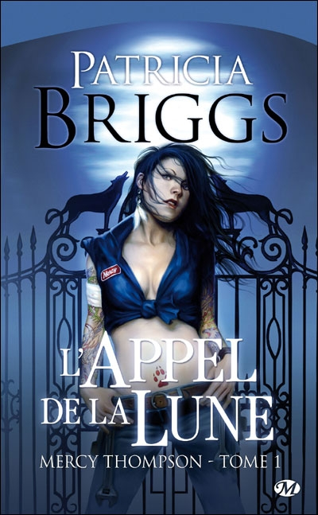
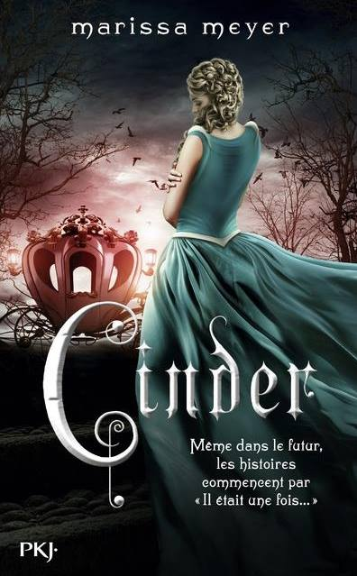
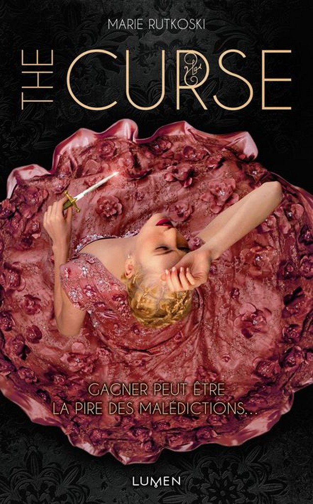
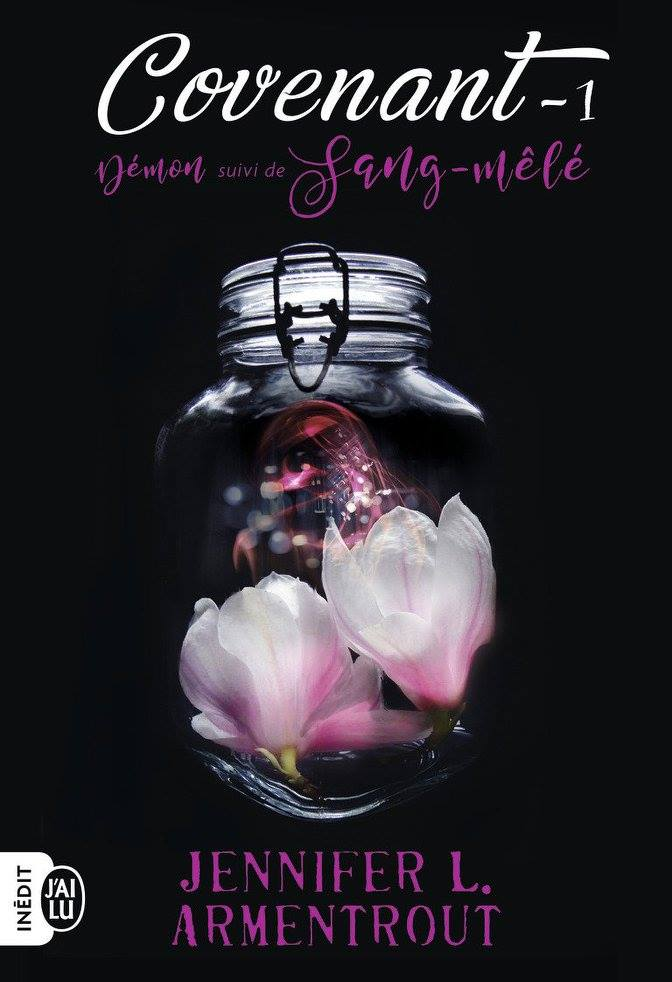
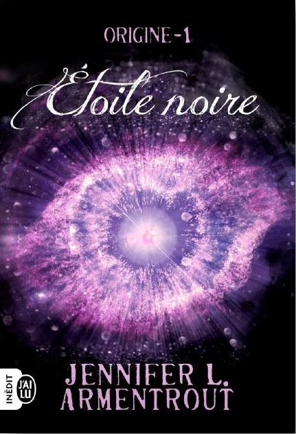

```{r setup, include=FALSE}
knitr::opts_chunk$set(echo = TRUE)
```

## "L'appel de la lune" ~ Patricia Briggs 



"Les loups-garous peuvent être dangereux si vous vous mettez en travers de leur chemin. Ils ont un talent extraordinaire pour dissimuler leur véritable nature aux yeux des humains. Mais moi, je ne suis pas tout à fait humaine." En effet, Mercy Thompson n'est pas une fille des plus banales. Mécanicienne dans le Montana, c'est une dure à cuire qui n'hésite pas à mettre les mains dans le cambouis et à sortir les griffes quand le danger frappe à sa porte. Mais ce n'est pas tout : son voisin est le chef de meute d'une bande de loups-garous, le minibus qu'elle bricole en ce moment appartient à un vampire, et la vieille dame très digne qui lui rend visite vient jeter des sorts sur son garage. Au cœur de ce monde des créatures de la nuit, Mercy se trouve mêlée à une délicate affaire de meurtre et d'enlèvement..."


## "Les chroniques lunaires" ~ Merissa Mayer


"Les humains et les androids se pressent dans les rues bruyantes de la Nouvelle-Pékin. Une peste mortelle ravage la population. Depuis la lune, un peuple sans pitié observe la situation, en attendant de passer à l’attaque… Personne ne sait que le sort de la Terre ne dépend que d’une seule fille… Cinder est un cyborg, une mécanicienne très douée. Citoyenne de seconde classe, elle a un passé mystérieux, et vit avec ses désagréables belle-mère et belles-sœurs. Sa rencontre avec le prince Kai va la précipiter au cœur d’une lutte intergalactique. Partagée entre le devoir et la liberté, la loyauté et la trahison, elle doit découvrir les secrets de son passé, afin de protéger l’avenir de son monde."

## "The curse" ~ Marie Rutkoski



"Fille du plus célèbre général d'un empire conquérant, Kestrel n'a que deux choix devant elle : s'enrôler dans l'armée ou se marier. Mais à dix-sept ans à peine, elle n'est pas prête à se fermer ainsi tous les horizons. Un jour, au marché, elle cède à une impulsion et acquiert pour une petite fortune un esclave rebelle à qui elle espère éviter la mort. Bientôt, toute la ville ne parle plus que de son coup de folie. Kestrel vient de succomber à la " malédiction du vainqueur " : celui qui remporte une enchère achète forcément pour un prix trop élevé l'objet de sa convoitise. 
Elle ignore encore qu'elle est loin, bien loin, d'avoir fini de payer son geste. Joueuse hors pair, stratège confirmée, elle a la réputation de toujours savoir quand on lui ment. Elle croit donc deviner une partie du passé tourmenté de l'esclave, Arin, et comprend qu'il n'est pas qui il paraît... Mais ce qu'elle soupçonne n'est qu'une infime partie de la vérité, une vérité qui pourrait bien lui coûter la vie, à elle et à tout son entourage. 
Gagner peut être la pire des malédictions...
Jeux de pouvoir, coups de bluff et pièges insidieux : dans un monde nouveau, né de l'imagination d'une auteure unanimement saluée pour son talent, deux jeunes gens que tout oppose se livrent à une partie de poker menteur qui pourrait bien décider de la destinée de tout un peuple !"

## "Covenant" ~ Jennifer L. Armentrout 



"Sur une île au large de la Caroline du Nord vivent les hematoï, des individus au sang pur et aux pouvoirs divins capables de maîtriser les quatre éléments. Ceux dont la lignée a connu un métissage sont contraints de choisir leur destin : intégrer le corps des Sentinelles du Covenant pour chasser les démons, leurs ennemis originels, ou être réduits à la servitude.
De retour depuis peu au Covenant pour des raisons qui lui appartiennent, Alexandria n’a pas le choix : fille d’une hématoï et d’un simple mortel, elle se doit de réussir l’examen lui permettant de devenir Sentinelle. L’institution applique une discipline de fer, et les relations entre les sang-pur et les sang-mêlé sont formellement interdites, sous peine d’exclusion, ou pire. Une règle qui pourrait être simple si Aiden, un sang-pur aux yeux couleur d’orage qu’Alex convoite depuis toujours, n’avait pas été désigné comme son entraîneur personnel...
En bonus, découvrez les origines d’Alexandria dans le préquel Démon : bienvenue au Covenant !"

## "L'étoile noire" ~ Jennifer L. Armentrout 



"Quatre ans se sont écoulés depuis l’invasion extraterrestre. À l’âge de 17 ans, Evie Dasher n’en a que peu de souvenirs. Lorsqu’elle décide de se rendre en cachette dans une boîte de nuit connue pour être l’un des rares lieux où il est encore possible de côtoyer les Luxens survivants, la soirée ne se déroule pas tout à fait comme prévu.
Quand les choses tournent mal, elle fait la connaissance de Luc, un jeune homme beaucoup trop beau pour être humain. De plus en plus attirée par celui qu’elle prend pour un Luxen, Evie découvre un monde insoupçonné qui remet en question tout ce qu’elle pensait savoir. Un monde composé d’êtres aussi lumineux que ténébreux…"
